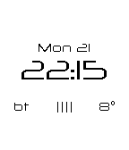
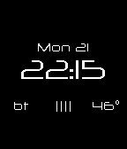

#### Pebble Watchface "Feather"
Feather is a lightweight watchface for Pebble. It shows time, date, battery charge level, phone connection, and temperature. Temperature is fetched from [OpenWeatherMap] (http://openweathermap.org/).

###### Note
For licensing reasons, the font used ([Neuropol X] (http://typodermicfonts.com/neuropol-x/)) is not published here. The watchface expects the TrueType font file under: /resources/fonts/neuropol_x_reg.ttf You can replace the font with any TrueType font file. If so, the references in /appinfo.json need to be adapted.

An API key is required to fetch weather information using the API of [OpenWeatherMap] (http://openweathermap.org/). You can get one [here at the OpenWeatherMap website] (http://openweathermap.org/appid#get). Replace the placeholder 'YOUR API KEY GOES HERE' in /src/js/temperature.js with your actual API key.

The configuration page requires [Slate](https://github.com/pebble/slate) in version 0.3.3. (More precisely: slate.min.js, slate.min.css, PFDinDisplayPro-Light.woff, PTSans-regular.woff)

 __ 
